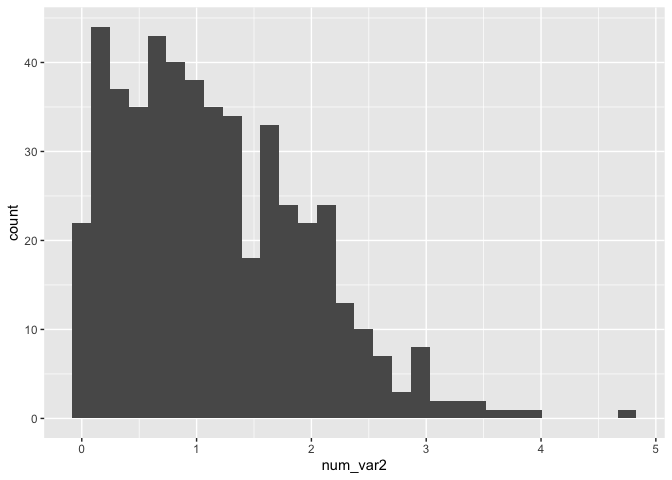

Simple document
================

Notes from lecture:

``` r
#example_df$vec_numberic #DN you this structure, use below 
#pull(example_df, vec_numeric) #better structure 
```

I’m an R Markdown document\!

# Section 1

Here’s a **code chunk** that samples from a *normal distribution*:

``` r
library(tidyverse)
```

    ## ── Attaching packages ──────────────────── tidyverse 1.2.1 ──

    ## ✔ ggplot2 3.2.1     ✔ purrr   0.3.2
    ## ✔ tibble  2.1.3     ✔ dplyr   0.8.3
    ## ✔ tidyr   0.8.3     ✔ stringr 1.4.0
    ## ✔ readr   1.3.1     ✔ forcats 0.4.0

    ## ── Conflicts ─────────────────────── tidyverse_conflicts() ──
    ## ✖ dplyr::filter() masks stats::filter()
    ## ✖ dplyr::lag()    masks stats::lag()

``` r
samp = rnorm(100)
length(samp)
```

    ## [1] 100

# Section 2

I can take the mean of the sample, too\!

eval = FALSE: code will be displayed but not executed; results are not
included. echo = FALSE: code will be executed but not displayed; results
are included. include = FALSE: code will be executed but not displayed;
results are not included. message = FALSE and warning = FALSE: prevents
messages and warnings from being displayed. results = hide and fig.show
= hide: prevents results and figures from being shown, respectively.
collapse = TRUE: output will be collapsed into a single block at shown
at the end of the chunk. error: errors in code will stop rendering when
FALSE; errors in code will be printed in the doc when TRUE. The default
is FALSE and you should almost never change it.

the number of rows in `plot_df` is 1000. \*\*\*

control+option + I \<- hot keys for inserting new code chunk

Write a named code chunk that creates a dataframe comprised of: a
numeric variable containing a random sample of size 500 from a normal
variable with mean 1; a logical vector indicating whether each sampled
value is greater than zero; and a numeric vector containing the absolute
value of each element. Then, produce a histogram of the absolute value
variable just created. Add an inline summary giving the median value
rounded to two decimal places. What happens if you set eval = FALSE to
the code chunk? What about echo = FALSE?

``` r
df <- tibble(
  num_var = rnorm(500, mean = 1), 
  binary_var = num_var > 0, # binary_var  = ifelse(num_var > 0, 1, 0), 
  num_var2 = abs(num_var)
)
ggplot( df, aes(x = num_var2)) + geom_histogram()
```

    ## `stat_bin()` using `bins = 30`. Pick better value with `binwidth`.

<!-- -->

``` r
median_samp = median(pull(df, num_var))
```

Inline summary:

The median of the sample is 0.98.

## Tables

| First Header | Second Header |
| ------------ | ------------- |
| Content Cell | Content Cell  |
| Content Cell | Content Cell  |

  - The mean of the sample is 1.0051394.
  - The median of the sample is 0.9826299.
  - The standard deviation of the sample is 0.9962317.
